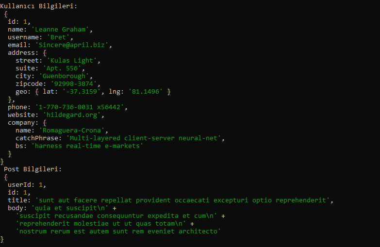

# Node.js ile Birlikte Örnek Kullanıcı ve Postu Ekrana Getirme

* Bu örnekte node.js kullanılmıştır.
* getData.js dosyasında getData adında asenkron bir fonksiyon tanımlanmıştır ve içerisinde users ile posts olarak iki adet const değişken tanımlanmıştır. 
* Bu değişkenlerin içerisine await ile birlikte https://jsonplaceholder.typicode.com/users/userID ve https://jsonplaceholder.typicode.com/posts/userID eklenmiştir. userID alanları değişken alandır ve fonksiyonun içerisinde tanımlanmıştır, dışarıdan parametre almaktadır. Bu userID'ye göre bilgiler gelmektedir.
* Daha sonra bu js fonksiyon default olarak dışarı aktarılmıştır.
* app.js dosyasında ise default olarak dışarı aktarılan getData.js import edilmiş, ardından bir Number parametre ile fonksiyon çalıştırılmıştır.

 
